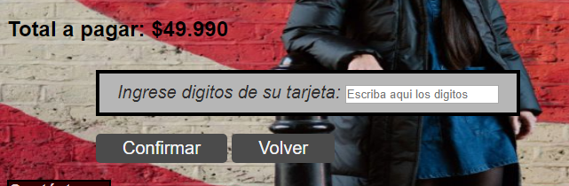
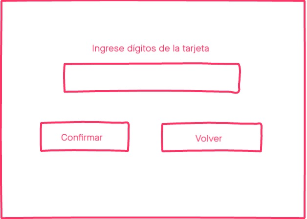
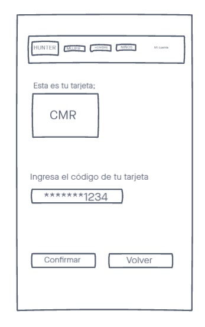

# Validación tarjeta de crédito

## Índice

* [1. Resumen](#1-resumen)
* [2. Imagen del proyecto](#3-imagen-del-proyecto)
* [3. Investigación UX](#3-investigación-ux)

***

## 1. Resumen del proyecto

El [algoritmo de Luhn](https://es.wikipedia.org/wiki/Algoritmo_de_Luhn),
también llamado algoritmo de módulo 10, es un método de suma de verificación,
se utiliza para validar números de identificación; tales como el IMEI de los
celulares, tarjetas de crédito, etc.

Este algoritmo es simple. Obtenemos la reversa del número a verificar (que
solamente contiene dígitos [0-9]); a todos los números que ocupan una posición
par se les debe multiplicar por dos, si este número es mayor o igual a 10,
debemos sumar los dígitos del resultado; el número a verificar será válido si
la suma de sus dígitos finales es un múltiplo de 10.

En este proyecto trabajamos en duplas, pensando en un E-commerce, implementando el algoritmo de Luhn
para comprobar si los dígitos que ingresa un usuario de una tarjeta de crédito son válidos o 
no, ocultando los caracteres y verificando que sólo puedan ingresarse números en el formulario. 

## 2. Imagen del proyecto

## 3. Investigación UX

* **Quiénes son los usuarios:** Nuestro producto va dedicado a un sector acomodado con interés en ropa 
exclusiva, como botas o abrigos, mayormente mujeres jóvenes y de mediana edad. 
* **Cómo el producto soluciona los problemas de los usuarios:** Debido a la contingencia actual debido al 
coronavirus, muchas tiendas han decidido incursionar en el mundo del comercio digital, en el cuál los usuarios
pueden buscar y comprar productos desde la comodidad de sus hogares. Nuestro producto ofrece vestuario que puede
ser comprado en línea, evitando que la persona deba dejar su hogar para realizar su compra.
* **Primer prototipo de papel:**

* **Feedback recibido de las compañeras:** Luego de mostrar nuestro proyeto a nuestras compañeras de squad, nos 
sugirieron agregar botones para volver a la página anterior para hacer el uso más cómodo dentro de la misma
página, pensando en una mejor usabilidad.
* **Prototipo final del producto:**

